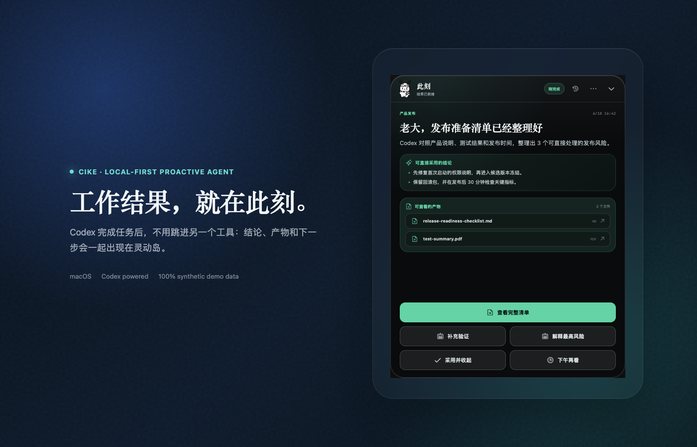
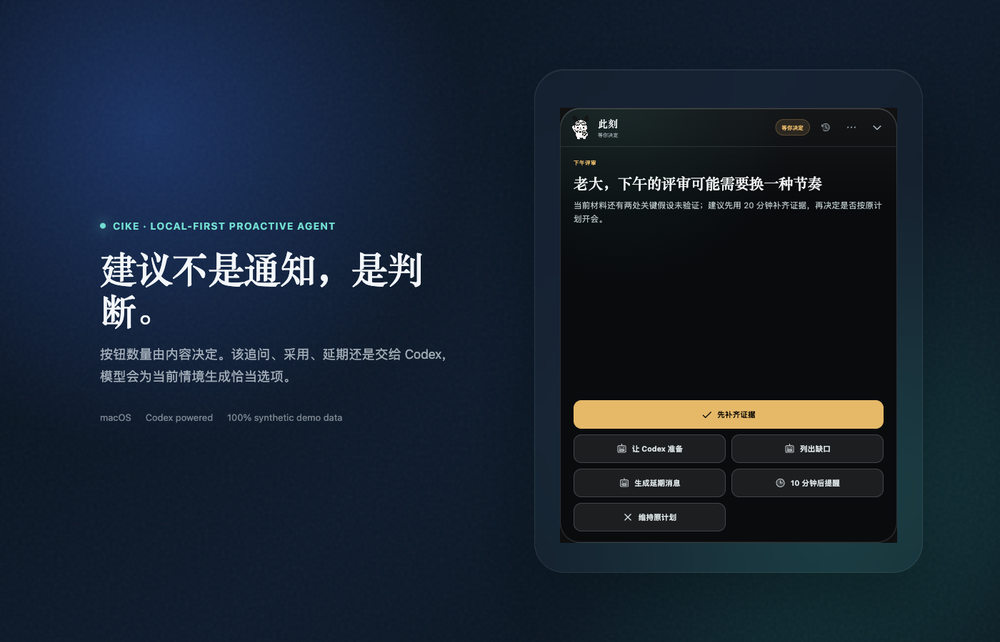
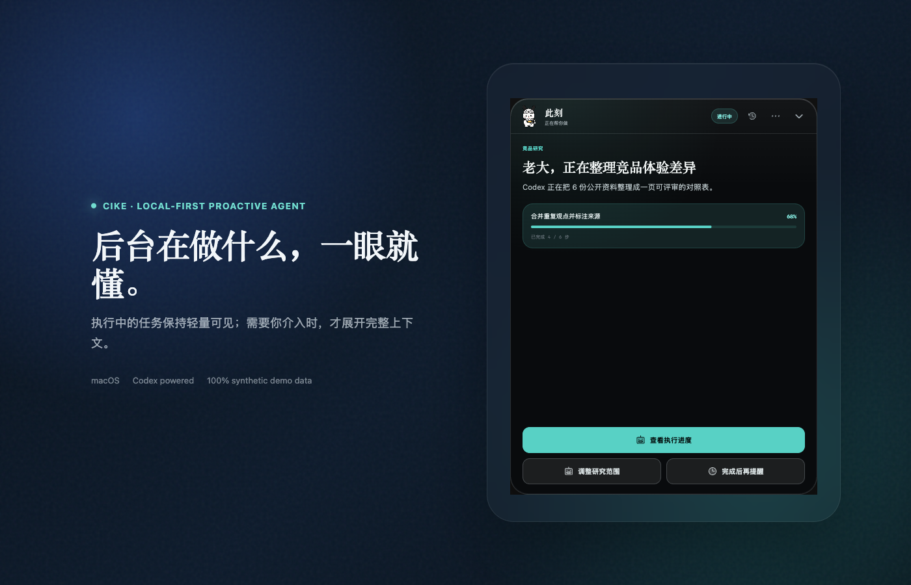

# 此刻 Cike

> 主动理解你正在做什么，主动让 Codex 把事做完，再把结果直接交给你。

此刻不是一个等你输入 query 的聊天框，也不是消息提醒器。它是一款常驻 macOS 灵动岛的本地主动式 Agent：在你授权后，持续读取 Chronicle 屏幕记忆、Codex 任务与 Loop 记录、日历和会议纪要、浏览器活动以及本地项目变化，理解你刚刚做了什么、接下来该推进什么，以及哪些工作可以直接交给 Codex。

当它识别到明确任务时，可以主动创建 Codex Work Order，检索、核对、审阅、写作或在授权项目内完成可逆改动；工作完成后，不只发一句“已完成”，而是把结论、验证过程和可点击产物直接交付到灵动岛。



## 什么才叫主动式 Agent

```text
主动读取记录 → 理解当前状态 → 判断是否值得介入 → 调用 Codex 做事 → 校验结果 → 直接交付内容
```

| 主动读取的信号 | 此刻如何使用 |
|---|---|
| **Chronicle 屏幕记忆** | 读取由屏幕截图提取的最新 OCR 状态，理解你当前停留的应用、任务和上下文 |
| **Codex 任务与 Loop** | 读取最近任务、自动化计划和运行结果，避免重复执行，并把 Loop 纳入接下来的工作规划 |
| **日历、会议纪要与待办** | 会后提炼真正属于你的 Todo，区分闲聊、他人任务、已完成事项和范围变化 |
| **浏览器与本地项目活动** | 感知近期检索方向、文件变化和项目阶段，发现需要收口、核对或提前准备的工作 |
| **你的采用、忽略和过期反馈** | 在本机学习什么值得推、什么不重要、什么时候介入更合适 |

原始记录不会直接变成通知。此刻先做责任判断、完成态检查、跨来源去重和价值过滤；只有已经产生新结论、Codex 已经完成工作，或确实需要你拍板时，才会出现。

### 一个完整例子

你开完一场发布评审会，没有再输入任何 query。此刻从会议纪要和屏幕记忆中识别到“发布前核对权限说明与回滚方案”是你的未完成任务，关联到已授权的本地项目，主动让 Codex 检查说明、测试与变更。Codex 完成后，灵动岛直接给你：

- 当前是否可以发布的结论；
- 需要先处理的风险与判断依据；
- 已生成的发布清单和测试摘要；
- “采用并收起”“补充验证”“解释最高风险”等针对这件事动态生成的操作。

这条链路不局限于会议、论文或方案。检索资料、比较版本、审阅文档、整理表格、检查代码、更新授权项目和规划后续工作，都走同一套主动发现、Codex 执行与结果交付流程。

## 它和通知中心有什么不同

- **先主动做事，再选择介入**：能由 Codex 安全完成的工作会先在后台准备，不把“发现了一个 Todo”当成成果。
- **先过滤，再出现**：闲聊、重复、已读、已完成、不重要和过期内容不会留在主面板。
- **建议是判断，不是转发**：界面只讲“现在该做什么”和“为什么”，不复读原始消息。
- **按钮随情境生成**：可以是 2 个，也可以是 6 个；数量和措辞由当前建议决定，不套固定模板。
- **Codex 原生执行与交付**：此刻主动创建任务，Codex 完成实际工作，结论、文件和下一步直接在灵动岛里查看，需要深挖时再进入 Codex。
- **本地优先**：状态、反馈和用户偏好保存在本机；连接器与项目目录均由用户显式开启。

## 三种时刻

| | 此刻会做什么 |
|---|---|
| 没有新价值 | 收回摄像头区域，只留下嘟嘟和必要状态 |
| 值得建议 | 在合适的任务切换点给出一条可行动的判断 |
| Codex 已完成 | 展示结论、验证、产物和动态操作按钮 |

<p align="center">
  
  
</p>

> 仓库中的全部截图均由内置 synthetic demo data 生成，不包含真实用户、公司、项目、会议、消息或文件数据。

## 可以怎样使用

### 会后跟进

授权会议纪要后，此刻只提取明确属于你的未完成事项。若 Codex 已经可以安全准备材料，它会先做完，再用一张结果卡交付；仅有会议标题时不会编造结论。

### 发布前检查

在候选版本冻结前，将本地项目以只读或可逆写入方式授权给此刻。它可以让 Codex 核对测试、变更和说明，并把阻塞风险整理成可直接采用的清单。

### 项目节奏建议

当日历显示空档、项目出现新变更或多个任务争抢注意力时，此刻会给出排序建议；如果没有新增价值，它保持安静。

### 研究与材料审阅

把“检索资料、比较方案、审阅文档、整理表格”交给统一 Work Order。专业适配器是可选增强，通用结果始终可以在此刻内交付。

## 安装

从 [Releases](https://github.com/differance-dfhs/cike/releases) 下载最新的 `.dmg`，拖入 Applications 后打开。

当前公开预览包采用 ad-hoc 签名，尚未经过 Apple notarization。首次运行如被 macOS 阻止，请在“系统设置 → 隐私与安全性”中确认打开。更完整的步骤见 [INSTALL.md](INSTALL.md)。

## 开发

需要 Node.js 22+ 与 macOS：

```bash
npm ci
npm run typecheck
npm test
npm run build
```

启动开发版：

```bash
npm run dev
```

生成经过双层隐私扫描的 macOS 安装包：

```bash
npm run dist:mac:clean
```

## 隐私与安全

- 仓库、截图和发布包不包含 `.data`、运行历史、浏览器记录、用户画像、项目文件或本机绝对路径。
- 默认不上传遥测；敏感状态保存在应用的 macOS `userData` 目录。
- 本地项目只接受用户显式配置的真实目录；符号链接和越界路径会被拒绝。
- 远端写回、发送、发布和删除属于高风险动作，应在用户批准后执行。
- `npm run audit:public` 会检查源码中的绝对用户目录、凭据形态和可配置的私密标记；发布脚本会再扫描打包后的应用内容。

安全问题请按 [SECURITY.md](SECURITY.md) 私下报告，不要在公开 Issue 中附上真实工作数据。

## 项目文档

- [产品合同与 Silence Gate](PRODUCT.md)
- [架构与数据边界](ARCHITECTURE.md)
- [贡献指南](CONTRIBUTING.md)

此项目目前处于公开预览阶段。欢迎提交 Issue、设计反馈和适配器提案。

## License

[MIT](LICENSE)
